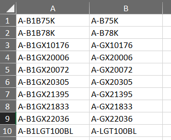
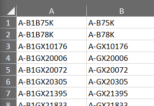
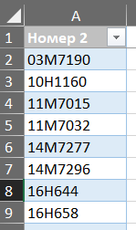

# CrossBon
##### It is program for look for cross for JD(maybe in late update for plus anymore)
### For run need
- CROSS what we have(Cross_have.xlsx)
- CROSS what we have from JD(DATA_JD.xlsx)
- Articles what we want to find cross(Article_need.xlsx)

## 1 CROSS what we have(Cross_have.xlsx)
Main element:
- "Код товара" under ["DD "+code]
- "Номер перекрестной ссылки" under [code]

## 2 CROSS what we have from JD(DATA_JD.xlsx)
Main step:
- *B* columns end cross
- *A* columns start cross
- Past Article to NEW-Article

## 3 Articles what we want to find cross(Article_need.xlsx)
Main Element
- "Номер 2" under Article what we want find 
- It is made for made faster work than past


If you want update project
use 
```
 requirements.txt
  ```
If you want test project
Open
```
 program/CrossBon
 or
 program/CrossBon.zip   
 ```
