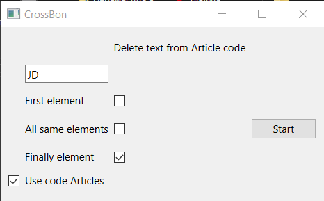

# CrossBon
##### It is program for look for cross for JD(maybe in late update for plus anymore)
### For run need
- CROSS what we have(Cross_have.xlsx)
- CROSS what we have from JD(DATA_JD.xlsx)
- Articles what we want to find cross(Article_need.xlsx)

## 1 CROSS what we have(Cross_have.xlsx)
Main element:
- "Код товара" under ["DD "+code]
- "Номер перекрестной ссылки" under [code]


## 2 CROSS what we have from JD(DATA_JD.xlsx)
Main step:
- *B* columns end cross
- *A* columns start cross
- Past Article to NEW-Article


## 3 Articles what we want to find cross(Article_need.xlsx)
Main Element
- "Номер" Article what we want find


# New update CrossBon 2.0 Visual program
#### don't forgot about need 3 file near ".py" file

### Have 2 mode
- Use only from cross DATA(connected without Article code[#help], can create cross and Data cross)
- Clear with Delete text from Article code and get Article code[#help].

### Visual program
Choose option,
- use code Articles, using only code "SD 12349". Article code = "12349" or include another option.
- use First element, clear data from text, example 12 : "SD 1234129". Article code = "34129")
- use All same elements "SD 123124129",example 12 : Article code = "349"
- use Finally element "SD 12345912",example 12 : Article code = "123459"



### use 
```
 requirements.txt
  ```
### If you want test project
Open
```
 program/CrossBon 2.0
 or
 program/CrossBon 2.0.zip   
 ```
# #Help
Article code - Element Article. You have "SD 12349". Article code = "12349"
If you want update project